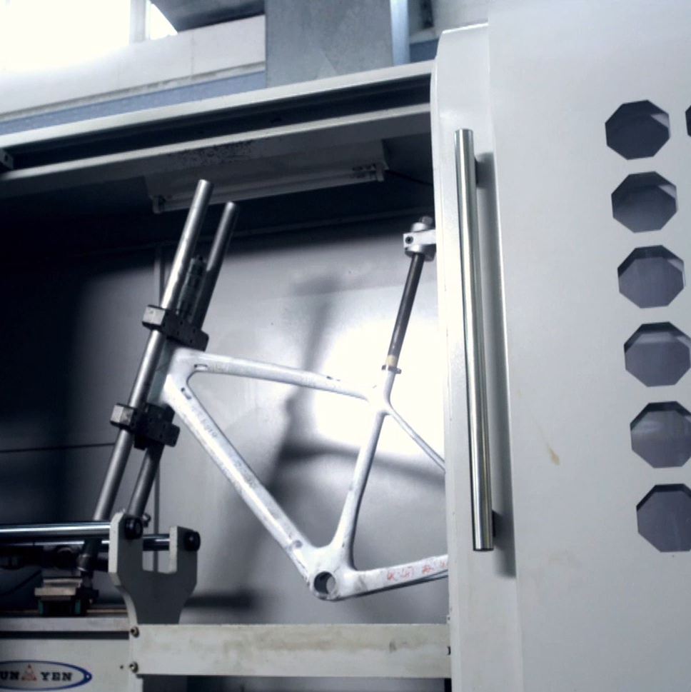

# Our Technology 页面 - 图片下载清单

## 📸 图片下载任务清单

### Hero背景图片（3张）

#### 1. Desktop Hero背景
- **Figma Node ID**: `3390:1332`
- **类型**: IMAGE-SVG
- **名称**: bg 1
- **保存路径**: `assets/images/technology/hero/hero-bg-desktop.png`
- **用途**: Desktop版本Hero背景
- **尺寸**: 1728px × 1179px（容器）
- **注意事项**: 确保图片覆盖整个容器

#### 2. Tablet Hero背景
- **Figma Node ID**: `3390:1497`
- **类型**: IMAGE-SVG
- **名称**: bg 1
- **保存路径**: `assets/images/technology/hero/hero-bg-tablet.png`
- **用途**: Tablet版本Hero背景
- **尺寸**: 1823.2px × 774px（实际图片尺寸）
- **容器尺寸**: 1024px × 774px
- **定位**: x: -400px（图片需要负定位）
- **注意事项**: 图片会超出容器左边，需要负定位

#### 3. Mobile Hero背景
- **Figma Node ID**: `3390:1124`
- **类型**: RECTANGLE (with image fill)
- **名称**: 2025.05.27实验室 1
- **ImageRef**: `1a0b4c2a0e39aca78e5320e0a050ae4f773f9f4c`
- **保存路径**: `assets/images/technology/hero/hero-bg-mobile.png`
- **用途**: Mobile版本Hero背景
- **尺寸**: 759px × 322px（实际图片尺寸）
- **容器尺寸**: 375px × 322px
- **定位**: x: -173px（图片需要负定位）
- **注意事项**: 图片会超出容器左边，需要负定位

---

### 卡片1图片："From Raw Materials..."（3张）

#### Desktop版本
- **Figma Node ID**: `3390:1345`
- **类型**: RECTANGLE (with image fill)
- **ImageRef**: `4393e3327a86b432053ac6afb550a2ced14f294c`
- **保存路径**: `assets/images/technology/cards/card-1-desktop-d03932.png`
- **需要裁剪**: ✅ Yes
- **CropTransform**: 
  ```json
  [
    [0.4524135887622833, 0, 0.04393921047449112],
    [0, 0.8363835215568542, 0.04656677693128586]
  ]
  ```
- **FilenameSuffix**: `d03932`
- **显示尺寸**: 高度 846px
- **圆角**: 10px

#### Tablet版本
- **Figma Node ID**: `3390:1509`
- **类型**: RECTANGLE (with image fill)
- **ImageRef**: `4393e3327a86b432053ac6afb550a2ced14f294c`
- **保存路径**: `assets/images/technology/cards/card-1-tablet-d03932.png`
- **需要裁剪**: ✅ Yes
- **CropTransform**: 
  ```json
  [
    [0.4524135887622833, 0, 0.04393921047449112],
    [0, 0.8363835215568542, 0.04656677693128586]
  ]
  ```
- **FilenameSuffix**: `d03932`
- **显示尺寸**: 高度 495px
- **圆角**: 5.85px

#### Mobile版本
- **Figma Node ID**: `3390:1130`
- **类型**: RECTANGLE (with image fill)
- **ImageRef**: `4393e3327a86b432053ac6afb550a2ced14f294c`
- **保存路径**: `assets/images/technology/cards/card-1-mobile-d03932.png`
- **需要裁剪**: ✅ Yes
- **CropTransform**: 
  ```json
  [
    [0.4524135887622833, 0, 0.04393921047449112],
    [0, 0.8363835215568542, 0.04656677693128586]
  ]
  ```
- **FilenameSuffix**: `d03932`
- **显示尺寸**: 363px × 323px
- **圆角**: 5px

---

### 卡片2图片："Smarter Production..."（3张）

#### Desktop版本
- **Figma Node ID**: `3390:1347`
- **类型**: RECTANGLE (with image fill)
- **ImageRef**: `02f99c151359328aafb7e351dac77ea15b11bfca`
- **保存路径**: `assets/images/technology/cards/card-2-desktop-5c9eb5.png`
- **需要裁剪**: ✅ Yes
- **CropTransform**: 
  ```json
  [
    [0.5042144656181335, 0, 0.28981056809425354],
    [0, 0.897442102432251, 0.004103092942386866]
  ]
  ```
- **FilenameSuffix**: `5c9eb5`
- **显示尺寸**: 高度 846px
- **圆角**: 10px

#### Tablet版本
- **Figma Node ID**: `3390:1511`
- **类型**: RECTANGLE (with image fill)
- **ImageRef**: `02f99c151359328aafb7e351dac77ea15b11bfca`
- **保存路径**: `assets/images/technology/cards/card-2-tablet-5c9eb5.png`
- **需要裁剪**: ✅ Yes
- **CropTransform**: 
  ```json
  [
    [0.5042144656181335, 0, 0.28981056809425354],
    [0, 0.897442102432251, 0.004103092942386866]
  ]
  ```
- **FilenameSuffix**: `5c9eb5`
- **显示尺寸**: 高度 495px
- **圆角**: 5.75px

#### Mobile版本
- **Figma Node ID**: `3390:1135`
- **类型**: RECTANGLE (with image fill)
- **ImageRef**: `02f99c151359328aafb7e351dac77ea15b11bfca`
- **保存路径**: `assets/images/technology/cards/card-2-mobile-5c9eb5.png`
- **需要裁剪**: ✅ Yes
- **CropTransform**: 
  ```json
  [
    [0.5042144656181335, 0, 0.28981056809425354],
    [0, 0.897442102432251, 0.004103092942386866]
  ]
  ```
- **FilenameSuffix**: `5c9eb5`
- **显示尺寸**: 363px × 323px
- **圆角**: 5.75px

---

### 卡片3图片："Built for the Pros..."（3张）

#### Desktop版本
- **Figma Node ID**: `3390:1357`
- **类型**: RECTANGLE (with image fill)
- **ImageRef**: `2f219e526b524e3591bd33cbc7303e0864a47165`
- **保存路径**: `assets/images/technology/cards/card-3-desktop-179fdb.png`
- **需要裁剪**: ✅ Yes
- **CropTransform**: 
  ```json
  [
    [0.5071930885314941, 0, 0.4738047122955322],
    [0, 0.9027436971664429, 0.005655435845255852]
  ]
  ```
- **FilenameSuffix**: `179fdb`
- **显示尺寸**: 高度 846px
- **圆角**: 10px

#### Tablet版本
- **Figma Node ID**: `3390:1521`
- **类型**: RECTANGLE (with image fill)
- **ImageRef**: `2f219e526b524e3591bd33cbc7303e0864a47165`
- **保存路径**: `assets/images/technology/cards/card-3-tablet-179fdb.png`
- **需要裁剪**: ✅ Yes
- **CropTransform**: 
  ```json
  [
    [0.5071930885314941, 0, 0.4738047122955322],
    [0, 0.9027436971664429, 0.005655435845255852]
  ]
  ```
- **FilenameSuffix**: `179fdb`
- **显示尺寸**: 高度 495px
- **圆角**: 5.75px

#### Mobile版本
- **Figma Node ID**: `3390:1140`
- **类型**: RECTANGLE (with image fill)
- **ImageRef**: `2f219e526b524e3591bd33cbc7303e0864a47165`
- **保存路径**: `assets/images/technology/cards/card-3-mobile-179fdb.png`
- **需要裁剪**: ✅ Yes
- **CropTransform**: 
  ```json
  [
    [0.5071930885314941, 0, 0.4738047122955322],
    [0, 0.9027436971664429, 0.005655435845255852]
  ]
  ```
- **FilenameSuffix**: `179fdb`
- **显示尺寸**: 363px × 323px
- **圆角**: 4.12px

---

## 📋 下载步骤

### 步骤1: 准备目录结构
```bash
mkdir -p assets/images/technology/hero
mkdir -p assets/images/technology/cards
```

### 步骤2: 下载Hero背景图片
1. Desktop: Node ID `3390:1332`
2. Tablet: Node ID `3390:1497`（注意负定位）
3. Mobile: Node ID `3390:1124`（注意负定位）

### 步骤3: 下载卡片图片
按照以下顺序下载：

**卡片1**:
- Desktop: Node ID `3390:1345` → `card-1-desktop-d03932.png`
- Tablet: Node ID `3390:1509` → `card-1-tablet-d03932.png`
- Mobile: Node ID `3390:1130` → `card-1-mobile-d03932.png`

**卡片2**:
- Desktop: Node ID `3390:1347` → `card-2-desktop-5c9eb5.png`
- Tablet: Node ID `3390:1511` → `card-2-tablet-5c9eb5.png`
- Mobile: Node ID `3390:1135` → `card-2-mobile-5c9eb5.png`

**卡片3**:
- Desktop: Node ID `3390:1357` → `card-3-desktop-179fdb.png`
- Tablet: Node ID `3390:1521` → `card-3-tablet-179fdb.png`
- Mobile: Node ID `3390:1140` → `card-3-mobile-179fdb.png`

### 步骤4: 验证图片
- [ ] 检查所有图片是否正确下载
- [ ] 检查图片尺寸是否符合要求
- [ ] 检查裁剪是否正确应用
- [ ] 检查文件名是否正确

---

## 🎯 图片使用说明

### Hero背景图片使用
```css
/* Desktop */
.hero-background-desktop {
  background-image: url('../assets/images/technology/hero/hero-bg-desktop.png');
}

/* Tablet */
.hero-background-tablet {
  background-image: url('../assets/images/technology/hero/hero-bg-tablet.png');
  background-position: -400px 0; /* 负定位 */
}

/* Mobile */
.hero-background-mobile {
  background-image: url('../assets/images/technology/hero/hero-bg-mobile.png');
  background-position: -173px 0; /* 负定位 */
}
```

### 卡片图片使用
```html
<!-- 卡片1 -->


<!-- 卡片2 -->


<!-- 卡片3 -->

```

---

## ⚠️ 注意事项

1. **图片裁剪**: 所有卡片图片都需要使用Figma的cropTransform进行裁剪，确保使用正确的transform矩阵
2. **文件名后缀**: 必须包含正确的文件名后缀（d03932, 5c9eb5, 179fdb）
3. **图片格式**: 优先使用PNG格式，保持透明度
4. **图片优化**: 下载后需要优化图片大小，但不要过度压缩影响质量
5. **负定位**: Tablet和Mobile的Hero背景需要负定位，确保在CSS中正确设置

---

## ✅ 完成检查清单

- [ ] Hero背景图片（3张）下载完成
- [ ] 卡片1图片（3张）下载完成
- [ ] 卡片2图片（3张）下载完成
- [ ] 卡片3图片（3张）下载完成
- [ ] 所有图片文件名正确
- [ ] 所有图片尺寸正确
- [ ] 所有图片裁剪正确
- [ ] 图片路径正确

---

**总计**: 12张图片
**下载时间**: 预计30-60分钟
**文档版本**: 1.0


